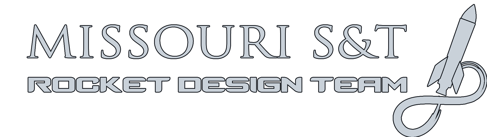

    

<em>*This repo is intended for educational purposes only*</em>

# About 
This project is the spiritual sucessor of the Rocket Design Team's (RDT) modular SRAD altimeter system for the Spaceport America 2022 competition. 

It aims to reduce complexity and overhead by doing away with the modular design and instead focusing on a single board. This will eliminate the difficulty in interfacing independent microcontrollers. By minimizing the area of the board it is anticipated that it may be flown on many more nonspecialized rockets, in an effort to build up flight data for verification. 

<strong>Once this platform has adequately matured, it is intended to be a viable parachute deployment system for S&T's Rockets.</strong>

# Documentation

# Development 

# Structure

